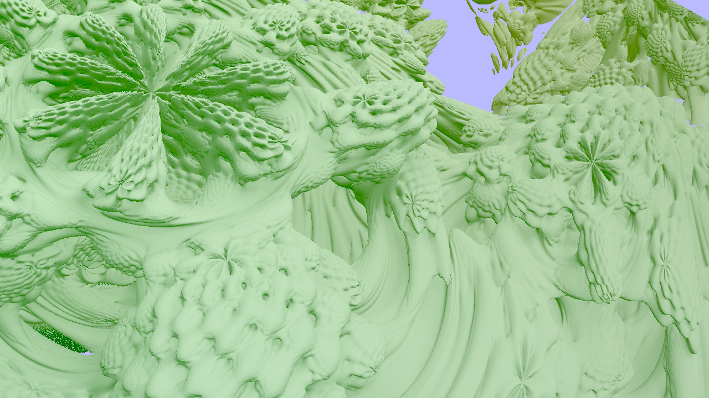
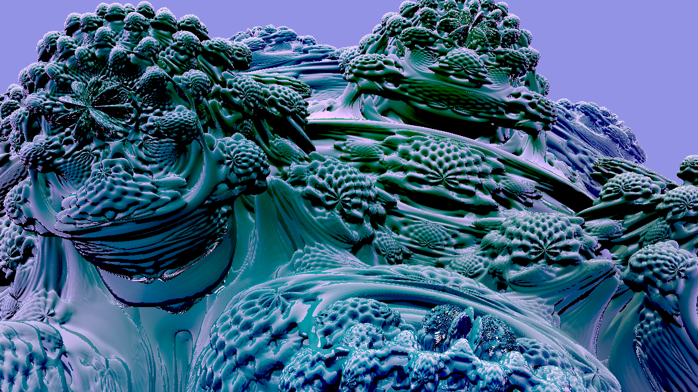
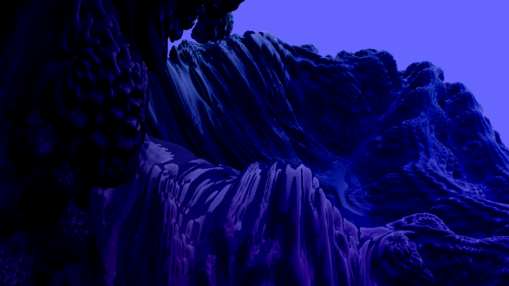

# OpenCLGL-ray-marching
A Realtime Signed Distance Field Ray Marcher accelerated using OpenCL and rendered to the screen using OpenGL.

This was a personal project of mine that I created in order to better understand OpenCL and other GPGPU programming languages. As a first project, in this field the resulting images are better than expected. Some of the biggest issues however with OpenCL is getting the application to run if the proper graphics drivers are not installed. There were a lot of intricacies with interoperability between OpenCL and OpenGL which I feel was a major bottleneck.

The kernel code for this ray marcher can be improved by reducing the number of flow control statements. Despite this, the performance on an integrated GPU is still realtime. Texture loading was dealt with using the SOIL library which is normally used for OpenGL related applications but works well for OpenCL as well. The only drawback was that on my Intel system, I could not load more than one texture into a kernel.

The signed distance field ray marching algorithm is an optimization over traditional fixed step ray marching and allows for a range of three dimensional primitives to be drawn with a small amount of ray march steps. A good resource for distance field primitives can be found at <a href="https://www.iquilezles.org/www/articles/distfunctions/distfunctions.htm"> Inigo Quilez's website<a>. There are many resources that cover the topic of ray marching especially for shader languages like GLSL.
  

I personally liked the output I got from the image above and used it as my desktop background for some time. Ray marching is a great way to design beautiful images with just a few mathematical functions.  
